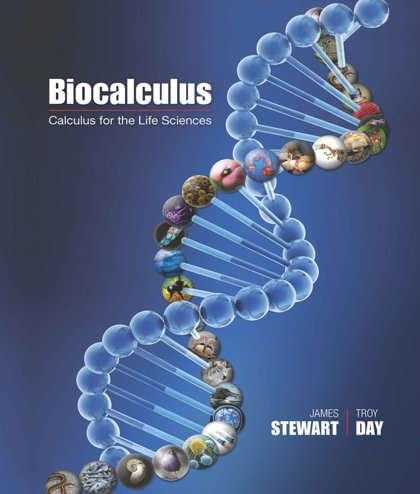
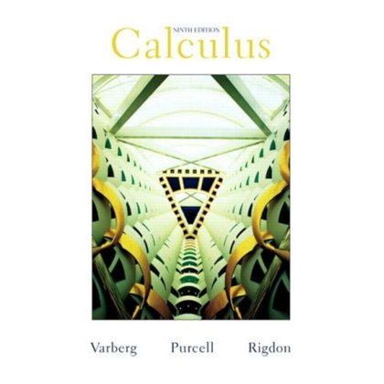
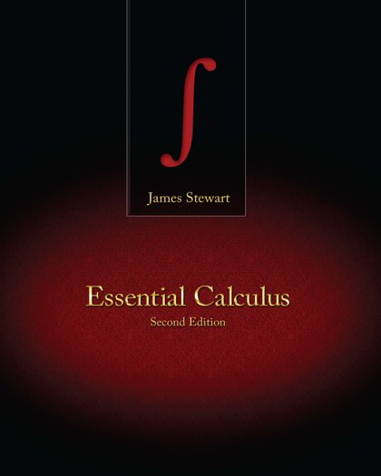
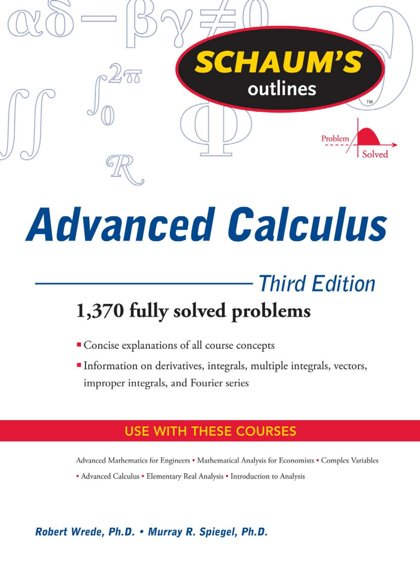
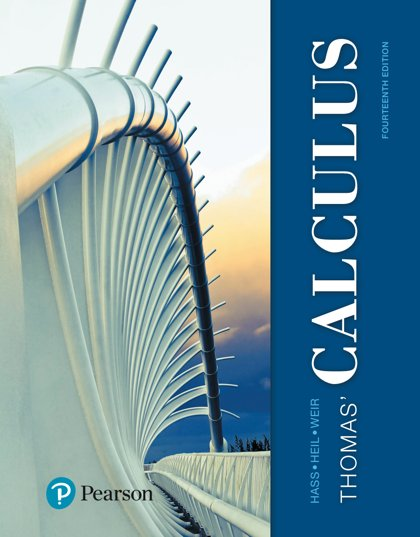

# 📈 Calculus

[← Back](README.md)

| 🖼️ Cover | 📖 Title | 🔖 Edition | ✍️ Author | 📄 PDF |
|:---:|:---|:---:|:---|:---:|
|  | **Biocalculus Calculus for Life Sciences** |  | Stewart and Day | [Download](https://github.com/Fincarson/eBooks/releases/download/academic/Biocalculus_Calculus_for_Life_Sciences_by_Stewart_and_Day.pdf) |
|  | **Calculus** | 9th Edition | Varberg | [Download](https://github.com/Fincarson/eBooks/releases/download/academic/Calculus_9th_Edition_by_Varberg.pdf) |
|  | **Essential Calculus** | 2nd Edition | James Stewart | [Download](https://github.com/Fincarson/eBooks/releases/download/academic/Essential_Calculus_2nd_Edition_by_James_Stewart.pdf) |
|  | **Schaums Outlines of Advanced Calculus** | 3rd Edition | Robert Wrede | [Download](https://github.com/Fincarson/eBooks/releases/download/academic/Schaums_Outlines_of_Advanced_Calculus_3rd_Edition_by_Robert_Wrede.pdf) |
|  | **Thomas Calculus** | 14th Edition |  | [Download](https://github.com/Fincarson/eBooks/releases/download/academic/Thomas_Calculus_14th_Edition.pdf) |
