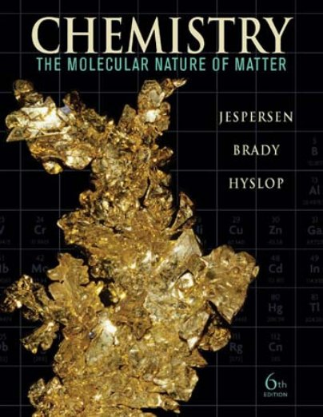
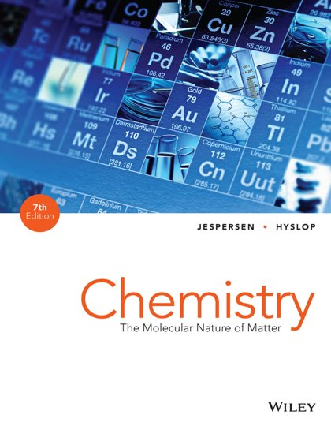
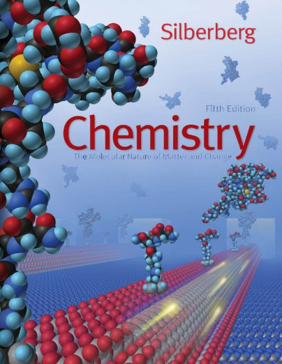
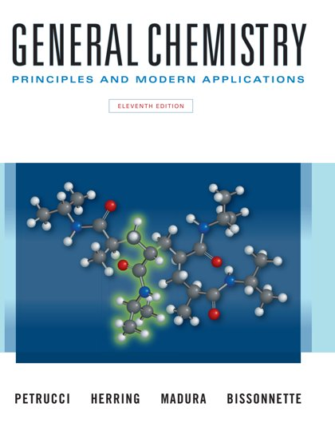
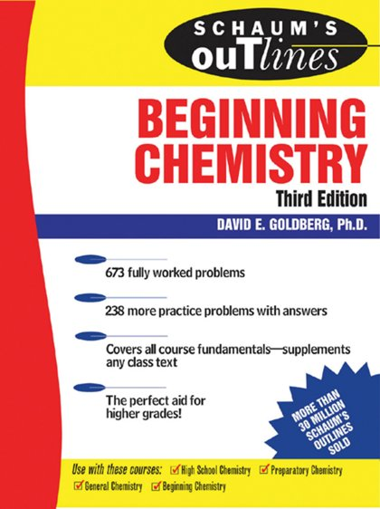

# ⚗️ Chemistry

[Back to Academic index](README.md)

**6** book(s). Click a link to download.

| 🖼️ Cover | 📖 Title | 🔖 Edition | ✍️ Author | ⬇️ Download |
|:---:|:---|:---:|:---|:---:|
|  | **Chemistry** | 10th Edition | Raymond Chang | [⬇️ PDF](https://github.com/Fincarson/eBooks/releases/download/academic/Chemistry_10th_Edition_by_Raymond_Chang.pdf) |
|  | **Chemistry The Molecular Nature of Matter** | 6th Edition | Jespersen Brady Hyslop | [⬇️ PDF](https://github.com/Fincarson/eBooks/releases/download/academic/Chemistry_The_Molecular_Nature_of_Matter_6th_Edition_by_Jespersen_Brady_Hyslop.pdf) |
|  | **Chemistry The Molecular Nature of Matter** | 7th Edition | Jespersen Brady Hyslop | [⬇️ PDF](https://github.com/Fincarson/eBooks/releases/download/academic/Chemistry_The_Molecular_Nature_of_Matter_7th_Edition_by_Jespersen_Brady_Hyslop.pdf) |
|  | **Chemistry The Molecular Nature of Matter and Change** | 5th Edition | Martin S Silberberg | [⬇️ PDF](https://github.com/Fincarson/eBooks/releases/download/academic/Chemistry_The_Molecular_Nature_of_Matter_and_Change_5th_Edition_by_Martin_S_Silberberg.pdf) |
|  | **General Chemistry Principles and Modern Applications** | 11th Edition | Ralph H Petrucci F Geoffrey Herring Jeffry D Madura Carey Bissonnette | [⬇️ PDF](https://github.com/Fincarson/eBooks/releases/download/academic/General_Chemistry_Principles_and_Modern_Applications_11th_Edition_by_Ralph_H_Petrucci_F_Geoffrey_Herring_Jeffry_D_Madura_Carey_Bissonnette.pdf) |
|  | **Schaums Outlines of Theory and Problems of Beginning Chemistry** | 3rd Edition | David E Goldberg | [⬇️ PDF](https://github.com/Fincarson/eBooks/releases/download/academic/Schaums_Outlines_of_Theory_and_Problems_of_Beginning_Chemistry_3rd_Edition_by_David_E_Goldberg.pdf) |
