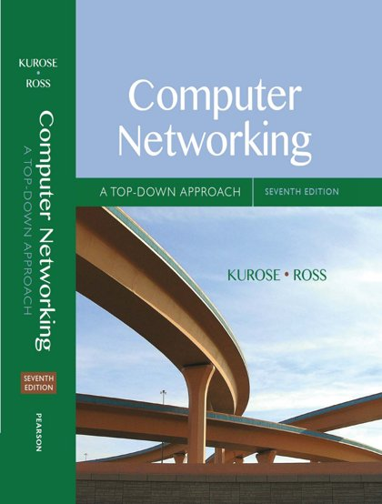
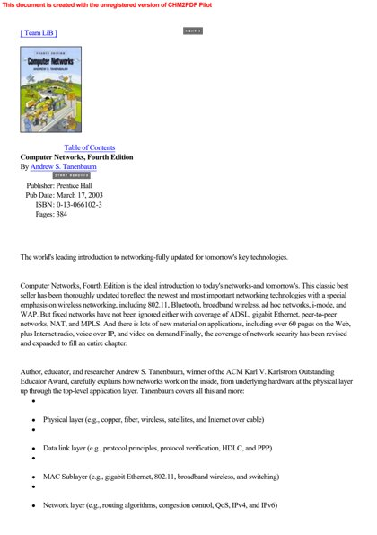

# 🌐 Computer Network

[Back to Academic index](README.md)

**3** book(s). Click a link to download.

| 🖼️ Cover | 📖 Title | 🔖 Edition | ✍️ Author | ⬇️ Download |
|:---:|:---|:---:|:---|:---:|
|  | **Computer Networking A Top Down Approach** | 7th Edition |  | [⬇️ PDF](https://github.com/Fincarson/eBooks/releases/download/academic/Computer_Networking_A_Top_Down_Approach_7th_Edition.pdf) |
|  | **Computer Networking A Top Down Approach** | 8th Edition |  | [⬇️ PDF](https://github.com/Fincarson/eBooks/releases/download/academic/Computer_Networking_A_Top_Down_Approach_8th_Edition.pdf) |
|  | **Computer Networks** | 4th Edition | Andrew S Tanenbaum | [⬇️ PDF](https://github.com/Fincarson/eBooks/releases/download/academic/Computer_Networks_4th_Edition_by_Andrew_S_Tanenbaum.pdf) |
