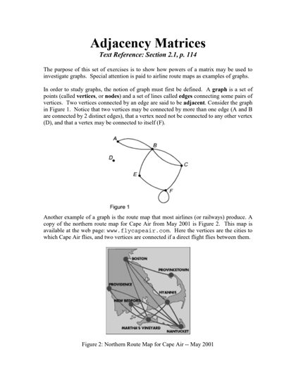
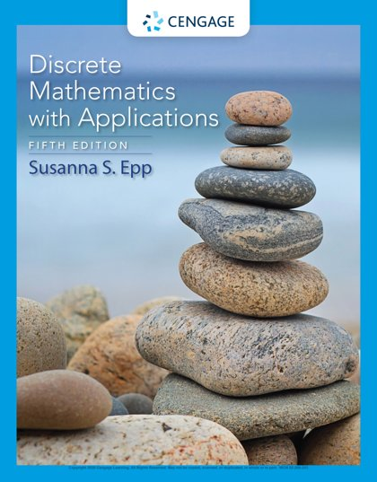
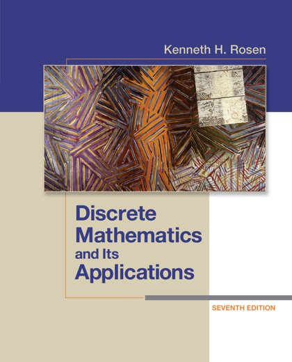
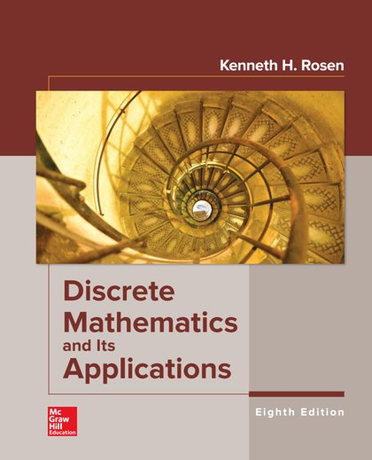

# 🔢 Discrete Mathematics

[Back to Academic index](README.md)

**4** book(s). Click a link to download.

| 🖼️ Cover | 📖 Title | 🔖 Edition | ✍️ Author | ⬇️ Download |
|:---:|:---|:---:|:---|:---:|
|  | **Adjacency Matrices** |  |  | [⬇️ PDF](https://github.com/Fincarson/eBooks/releases/download/academic/Adjacency_Matrices.pdf) |
|  | **Discrete Mathematics and Its Applications** | 5th Edition | Susanna S Epp | [⬇️ PDF](https://github.com/Fincarson/eBooks/releases/download/academic/Discrete_Mathematics_and_Its_Applications_5th_Edition_by_Susanna_S_Epp.pdf) |
|  | **Discrete Mathematics and Its Applications** | 7th Edition | Kenneth H Rosen | [⬇️ PDF](https://github.com/Fincarson/eBooks/releases/download/academic/Discrete_Mathematics_and_Its_Applications_7th_Edition_by_Kenneth_H_Rosen.pdf) |
|  | **Discrete Mathematics and Its Applications** | 8th Edition | Kenneth H Rosen | [⬇️ PDF](https://github.com/Fincarson/eBooks/releases/download/academic/Discrete_Mathematics_and_Its_Applications_8th_Edition_by_Kenneth_H_Rosen.pdf) |
