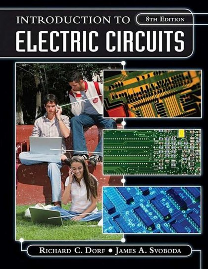
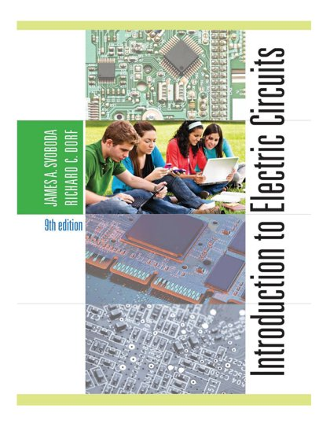

# 🔌 Electric Circuit

[Back to Academic index](README.md)

**2** book(s). Click a link to download.

| 🖼️ Cover | 📖 Title | 🔖 Edition | ✍️ Author | ⬇️ Download |
|:---:|:---|:---:|:---|:---:|
|  | **Introduction to Electric Circuits** | 8th Edition | Richard C Dorf | [⬇️ PDF](https://github.com/Fincarson/eBooks/releases/download/academic/Introduction_to_Electric_Circuits_8th_Edition_by_Richard_C_Dorf.pdf) |
|  | **Introduction to Electric Circuits** | 9th Edition | Richard C Dorf James A Svoboda | [⬇️ PDF](https://github.com/Fincarson/eBooks/releases/download/academic/Introduction_to_Electric_Circuits_9th_Edition_by_Richard_C_Dorf_James_A_Svoboda.pdf) |
