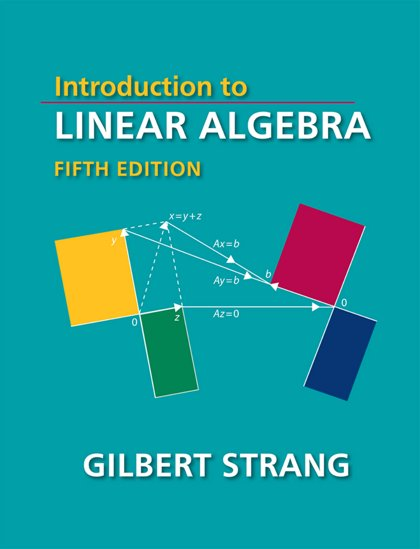
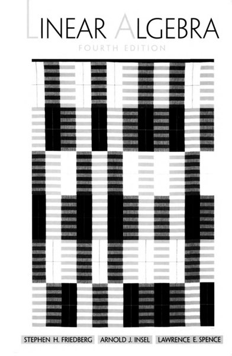
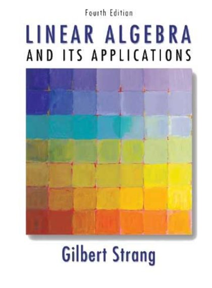
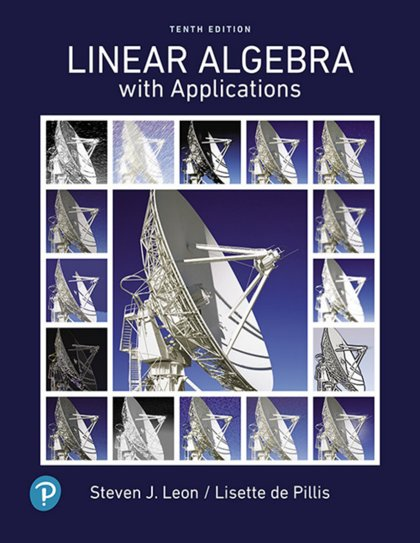
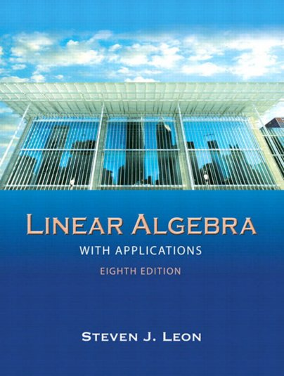
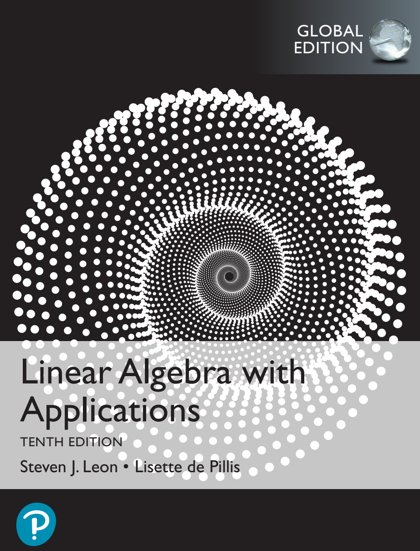

# 🧮 Linear Algebra

[← Back](README.md)

| 🖼️ Cover | 📖 Title | 🔖 Edition | ✍️ Author | 📄 PDF |
|:---:|:---|:---:|:---|:---:|
|  | **Introduction to Linear Algebra** | 5th Edition | Gilbert-Strang | [Download](https://github.com/Fincarson/eBooks/releases/download/academic/Introduction_to_Linear_Algebra_5th_Edition_by_Gilbert-Strang.pdf) |
|  | **Linear Algebra** | 4th Edition | Stephen | [Download](https://github.com/Fincarson/eBooks/releases/download/academic/Linear_Algebra_4th_Edition_by_Stephen.pdf) |
|  | **Linear Algebra and Its Applications** | 4th Edition | Gilbert Strang | [Download](https://github.com/Fincarson/eBooks/releases/download/academic/Linear_Algebra_and_Its_Applications_4th_Edition_by_Gilbert.Strang.pdf) |
|  | **Linear Algebra with Applications** | 10th Edition | Steven Leon | [Download](https://github.com/Fincarson/eBooks/releases/download/academic/Linear_Algebra_with_Applications_10th_Edition_by_Steven_Leon.pdf) |
|  | **Linear Algebra with Applications** | 8th Edition | Steven Leon | [Download](https://github.com/Fincarson/eBooks/releases/download/academic/Linear_Algebra_with_Applications_8th_Edition_by_Steven_Leon.pdf) |
|  | **Linear Algebra with Applications** | Global Edition | Steven Leon | [Download](https://github.com/Fincarson/eBooks/releases/download/academic/Linear_Algebra_with_Applications_Global_Edition_by_Steven_Leon.pdf) |
