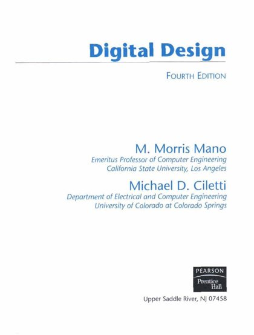
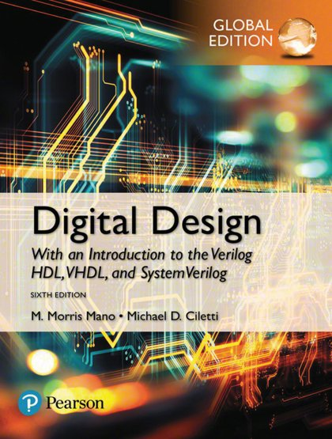

# 🧩 Logic Design

[← Back](README.md)

| 🖼️ Cover | 📖 Title | 🔖 Edition | ✍️ Author | 📄 PDF |
|:---:|:---|:---:|:---|:---:|
|  | **Digital Design** | 4th Edition | Morris Mano | [Download](https://github.com/Fincarson/eBooks/releases/download/academic/Digital_Design_4th_Edition_by_Morris_Mano.pdf) |
|  | **Digital Design** | 5th Edition | Morris Mano | [Download](https://github.com/Fincarson/eBooks/releases/download/academic/Digital_Design_5th_Edition_by_Morris_Mano.pdf) |
|  | **Digital Design** | 6th Edition | Michael Ciletti M Morris Mano | [Download](https://github.com/Fincarson/eBooks/releases/download/academic/Digital_Design_6th_Edition_by_Michael_Ciletti_M_Morris_Mano.pdf) |
|  | **Digital Design With an Introduction to the Verilog hdl vhdl and Systemverilog** | 6th Edition |  | [Download](https://github.com/Fincarson/eBooks/releases/download/academic/Digital_Design_With_an_Introduction_to_the_Verilog_hdl_vhdl_and_Systemverilog_6th_Edition.pdf) |
