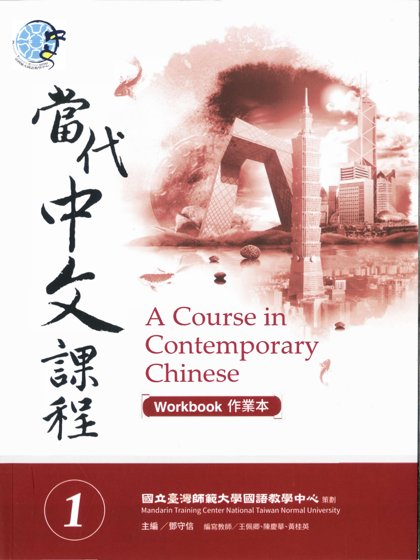
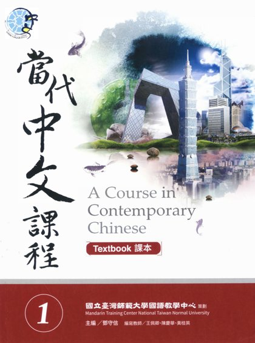
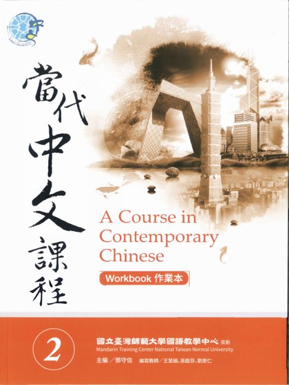
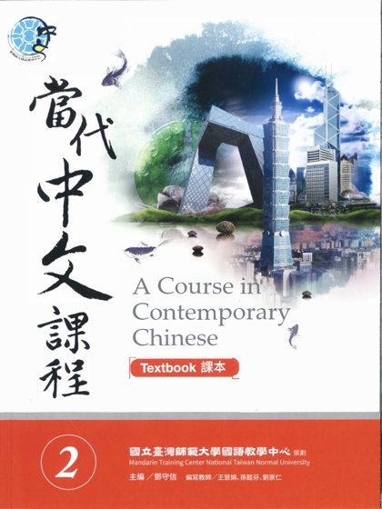
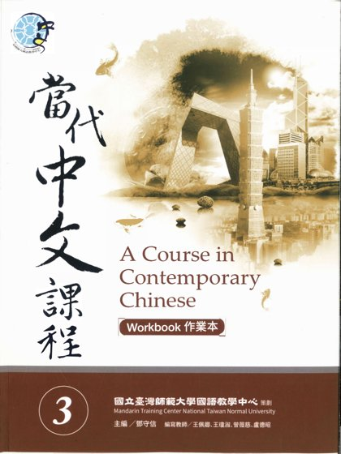
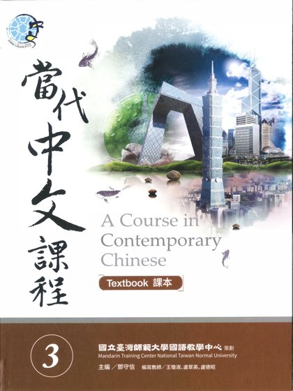
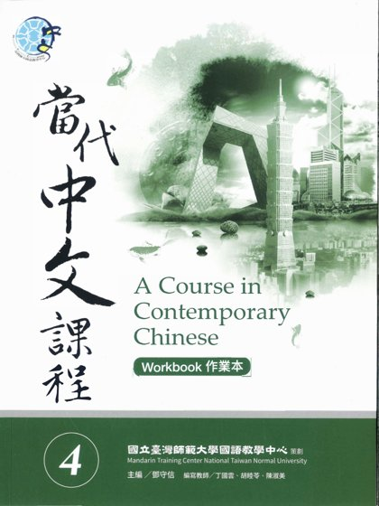
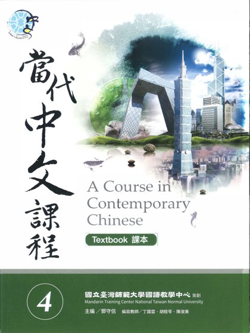
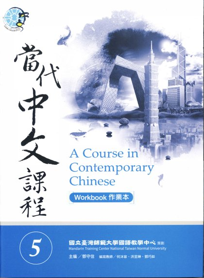
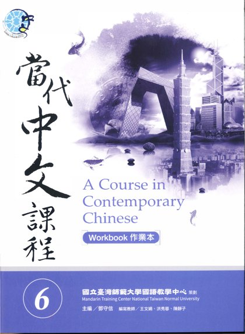

# 🀄 Mandarin

[← Back](README.md)

| 🖼️ Cover | 📖 Title | 🔖 Edition | ✍️ Author | 📄 PDF |
|:---:|:---|:---:|:---|:---:|
|  | **Fast Everyday Chinese** |  |  | [Download](https://github.com/Fincarson/eBooks/releases/download/academic/Fast_Everyday_Chinese.pdf) |
|  | **當代中文課程1 作業本** |  |  | [Download](https://github.com/Fincarson/eBooks/releases/download/academic/A_Course_in_Contemporary_Chinese_Book1_Workbook.pdf) |
|  | **當代中文課程1 課本** |  |  | [Download](https://github.com/Fincarson/eBooks/releases/download/academic/A_Course_in_Contemporary_Chinese_Book1_Textbook.pdf) |
|  | **當代中文課程2 作業本** |  |  | [Download](https://github.com/Fincarson/eBooks/releases/download/academic/A_Course_in_Contemporary_Chinese_Book2_Workbook.pdf) |
|  | **當代中文課程2 課本** |  |  | [Download](https://github.com/Fincarson/eBooks/releases/download/academic/A_Course_in_Contemporary_Chinese_Book2_Textbook.pdf) |
|  | **當代中文課程3 作業本** |  |  | [Download](https://github.com/Fincarson/eBooks/releases/download/academic/A_Course_in_Contemporary_Chinese_Book3_Workbook.pdf) |
|  | **當代中文課程3 課本** |  |  | [Download](https://github.com/Fincarson/eBooks/releases/download/academic/A_Course_in_Contemporary_Chinese_Book3_Textbook.pdf) |
|  | **當代中文課程4 作業本** |  |  | [Download](https://github.com/Fincarson/eBooks/releases/download/academic/A_Course_in_Contemporary_Chinese_Book4_Workbook.pdf) |
|  | **當代中文課程4 課本** |  |  | [Download](https://github.com/Fincarson/eBooks/releases/download/academic/A_Course_in_Contemporary_Chinese_Book4_Textbook.pdf) |
|  | **當代中文課程5 作業本** |  |  | [Download](https://github.com/Fincarson/eBooks/releases/download/academic/A_Course_in_Contemporary_Chinese_Book5_Workbook.pdf) |
|  | **當代中文課程6 作業本** |  |  | [Download](https://github.com/Fincarson/eBooks/releases/download/academic/A_Course_in_Contemporary_Chinese_Book6_Workbook.pdf) |
