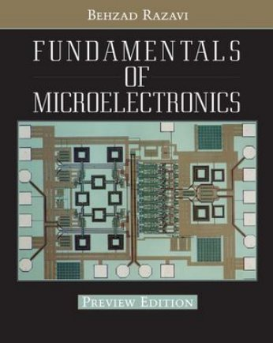

# 🔬 Microelectronics

[Back to Academic index](README.md)

**1** book(s). Click a link to download.

| 🖼️ Cover | 📖 Title | 🔖 Edition | ✍️ Author | ⬇️ Download |
|:---:|:---|:---:|:---|:---:|
|  | **Fundamentals of Microelectronics** |  | Behzad Razavi | [⬇️ PDF](https://github.com/Fincarson/eBooks/releases/download/academic/Fundamentals_of_Microelectronics_by_Behzad_Razavi.pdf) |
