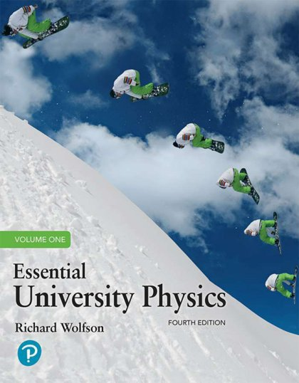
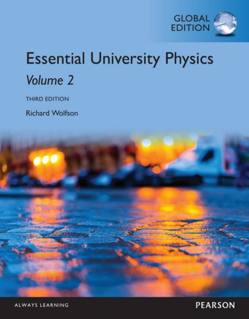
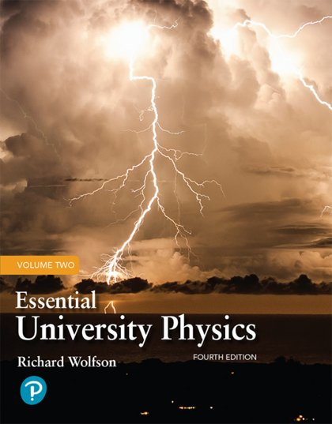
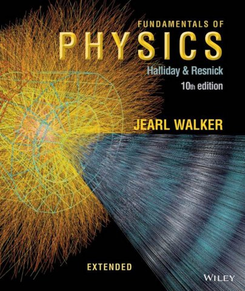
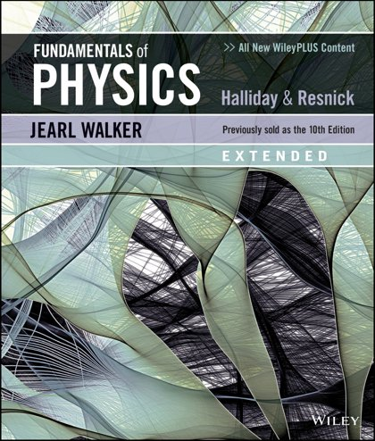
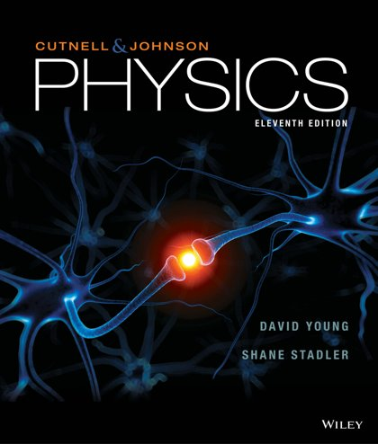
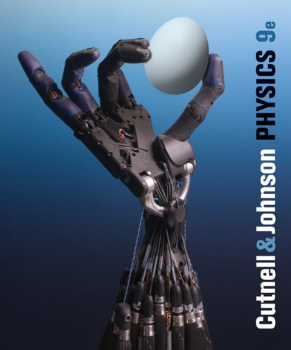
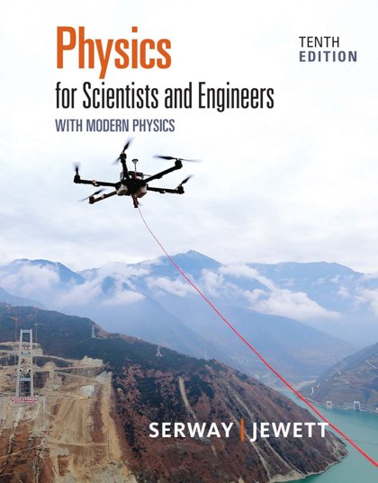
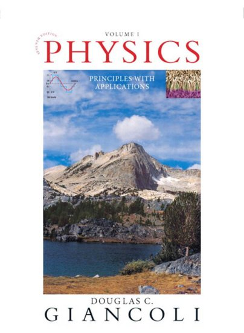
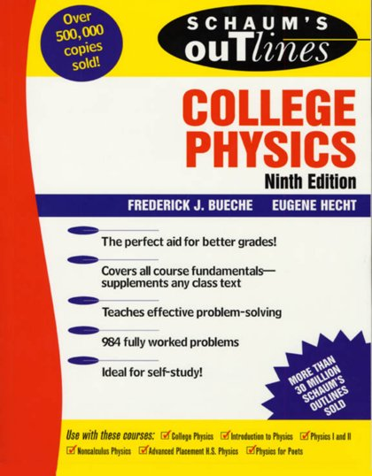

# ⚛️ Physics

[Back to Academic index](README.md)

**10** book(s). Click a link to download.

| 🖼️ Cover | 📖 Title | 🔖 Edition | ✍️ Author | ⬇️ Download |
|:---:|:---|:---:|:---|:---:|
|  | **Essential University Physics Volume1** | 4th Edition | Richard Wolfson | [⬇️ PDF](https://github.com/Fincarson/eBooks/releases/download/academic/Essential_University_Physics_Volume1_4th_Edition.by_Richard_Wolfson.pdf) |
|  | **Essential University Physics Volume2** | 3rd Edition | Richard Wolfson | [⬇️ PDF](https://github.com/Fincarson/eBooks/releases/download/academic/Essential_University_Physics_Volume2_3rd_Edition_by_Richard_Wolfson.pdf) |
|  | **Essential University Physics Volume2** | 4th Edition | Richard Wolfson | [⬇️ PDF](https://github.com/Fincarson/eBooks/releases/download/academic/Essential_University_Physics_Volume2_4th_Edition_by_Richard_Wolfson.pdf) |
|  | **Fundamentals of Physics** | 10th Edition | Halliday and Resnick | [⬇️ PDF](https://github.com/Fincarson/eBooks/releases/download/academic/Fundamentals_of_Physics_10th_Edition_by_Halliday_and_Resnick.pdf) |
|  | **Fundamentals of Physics** | 11th Edition | Halliday and Resnick | [⬇️ PDF](https://github.com/Fincarson/eBooks/releases/download/academic/Fundamentals_of_Physics_11th_Edition_by_Halliday_and_Resnick.pdf) |
|  | **Physics** | 11th Edition | John D Cutnell and Kenneth W Johnson | [⬇️ PDF](https://github.com/Fincarson/eBooks/releases/download/academic/Physics_11th_Edition_by_John_D_Cutnell_and_Kenneth_W_Johnson.pdf) |
|  | **Physics** | 9th Edition | John D Cutnell and Kenneth W Johnson | [⬇️ PDF](https://github.com/Fincarson/eBooks/releases/download/academic/Physics_9th_Edition_by_John_D_Cutnell_and_Kenneth_W_Johnson.pdf) |
|  | **Physics for Scientists and Engineers with Modern Physics** | 10th Edition | Raymond A Serway John W Jewett | [⬇️ PDF](https://github.com/Fincarson/eBooks/releases/download/academic/Physics_for_Scientists_and_Engineers_with_Modern_Physics_10th_Edition_by_Raymond_A_Serway_John_W_Jewett.pdf) |
|  | **Physics Principles with Applications** | 7th Edition | Douglas C Giancoli | [⬇️ PDF](https://github.com/Fincarson/eBooks/releases/download/academic/Physics_Principles_with_Applications_7th_Edition_by_Douglas_C_Giancoli.pdf) |
|  | **Schaums Outlines of Theory and Problems of College Physics** | 9th Edition |  | [⬇️ PDF](https://github.com/Fincarson/eBooks/releases/download/academic/Schaums_Outlines_of_Theory_and_Problems_of_College_Physics_9th_Edition.pdf) |
