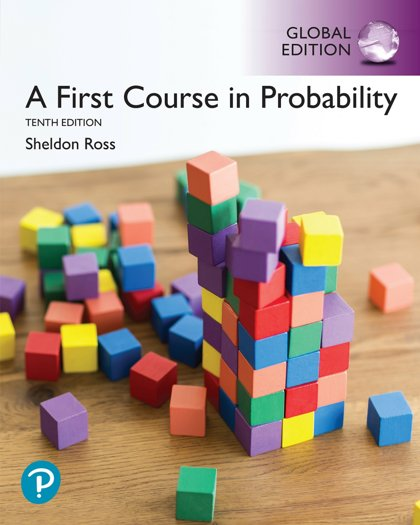
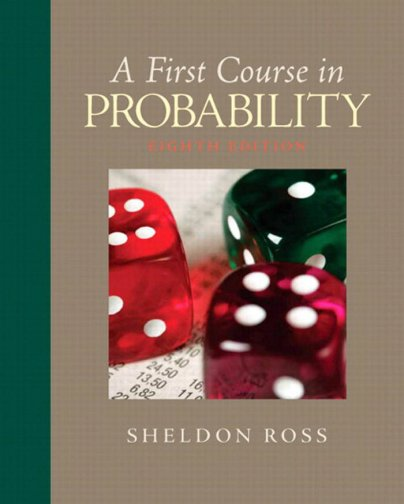
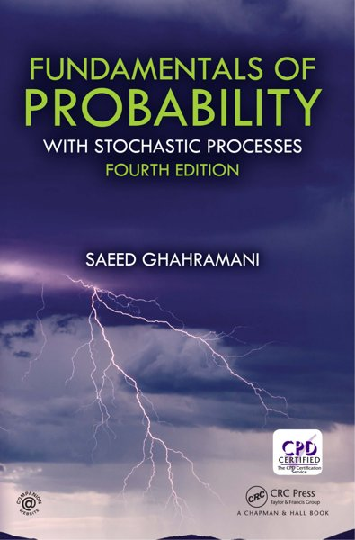

# 🎲 Probability

[Back to Academic index](README.md)

**3** book(s). Click a link to download.

| 🖼️ Cover | 📖 Title | 🔖 Edition | ✍️ Author | ⬇️ Download |
|:---:|:---|:---:|:---|:---:|
|  | **A First Course In Probability** | 10th Edition | Sheldon Ross | [⬇️ PDF](https://github.com/Fincarson/eBooks/releases/download/academic/A_First_Course_In_Probability_10th_Edition_by_Sheldon_Ross.pdf) |
|  | **A First Course In Probability** | 8th Edition |  | [⬇️ PDF](https://github.com/Fincarson/eBooks/releases/download/academic/A_First_Course_In_Probability_8th_Edition.pdf) |
|  | **Fundamentals of Probability with Stochastic Processes** | 4th Edition | Ghahramani Saeed | [⬇️ PDF](https://github.com/Fincarson/eBooks/releases/download/academic/Fundamentals_of_Probability_with_Stochastic_Processes_4th_Edition_by_Ghahramani_Saeed.pdf) |
