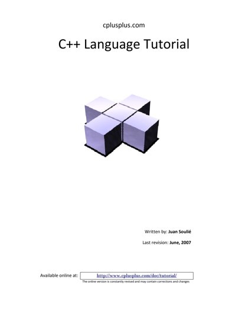
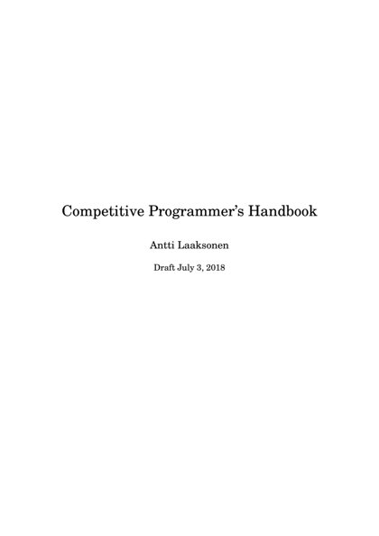
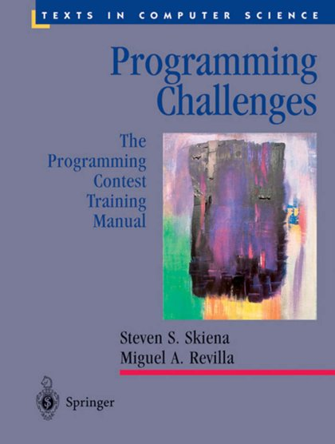
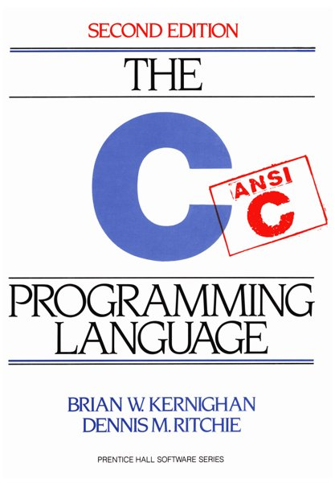
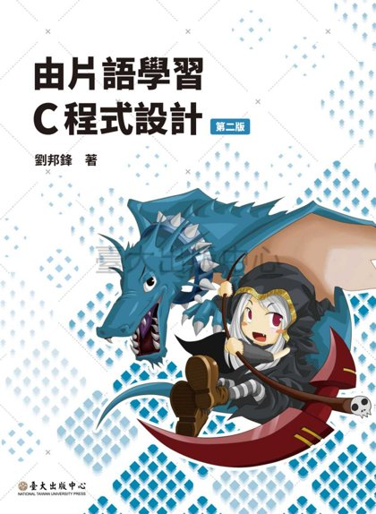

# 💻 Programming

[Back to Academic index](README.md)

**5** book(s). Click a link to download.

| 🖼️ Cover | 📖 Title | 🔖 Edition | ✍️ Author | ⬇️ Download |
|:---:|:---|:---:|:---|:---:|
|  | **C++ Language Tutorial** |  |  | [⬇️ PDF](https://github.com/Fincarson/eBooks/releases/download/academic/C%2B%2B_Language_Tutorial.pdf) |
|  | **Competitive Programmers Handbook** |  |  | [⬇️ PDF](https://github.com/Fincarson/eBooks/releases/download/academic/Competitive_Programmers_Handbook.pdf) |
|  | **Programming Challenges 2003** |  |  | [⬇️ PDF](https://github.com/Fincarson/eBooks/releases/download/academic/Programming_Challenges_2003.pdf) |
|  | **The C Programming Language** | 2nd Edition | Ritchie and Kernighan | [⬇️ PDF](https://github.com/Fincarson/eBooks/releases/download/academic/The_C_Programming_Language_2nd_Edition_by_Ritchie_and_Kernighan.pdf) |
|  | **由片語學習C程式設計 劉邦鋒 二版 臺北市 2019[民108 National Taiwan University Press** |  |  | [⬇️ PDF](https://github.com/Fincarson/eBooks/releases/download/academic/Learning_C_Programming_through_Phrases_2nd_Edition_NTU_Press.pdf) |
